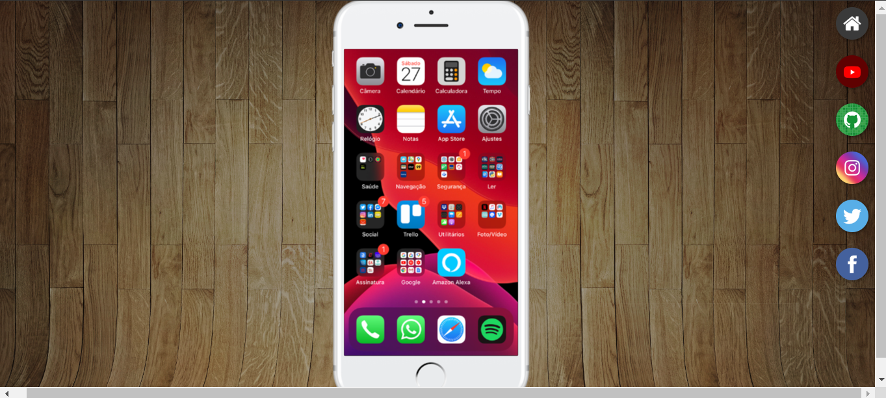
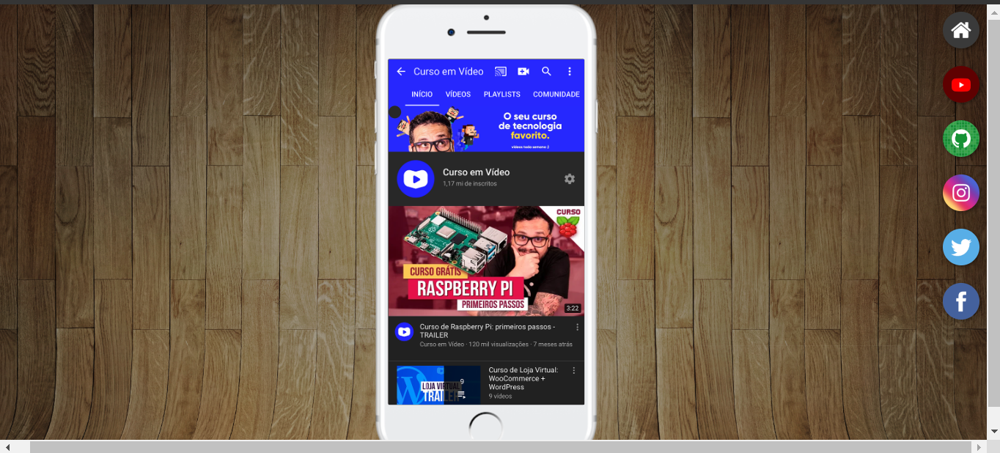
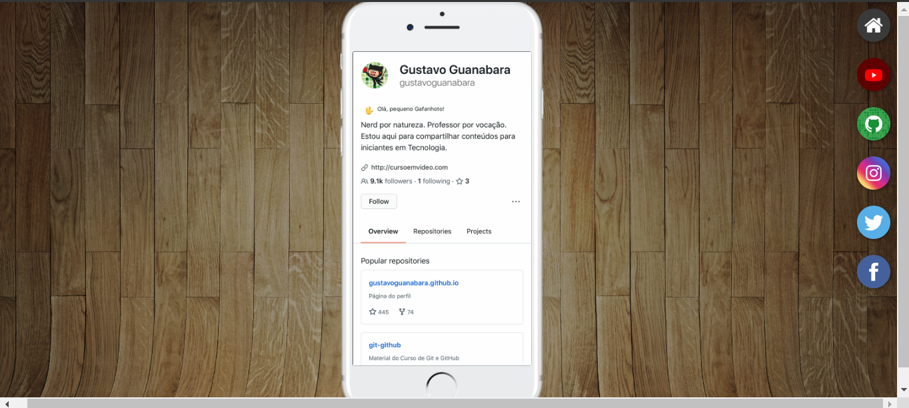
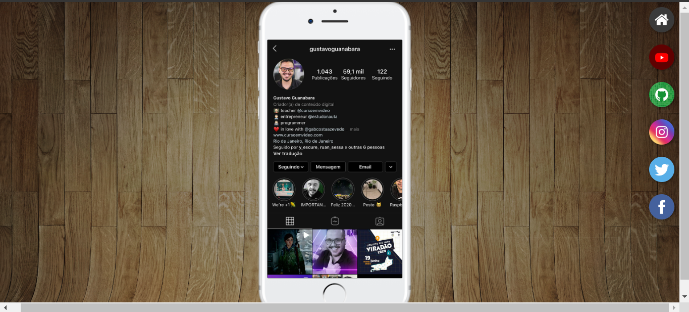
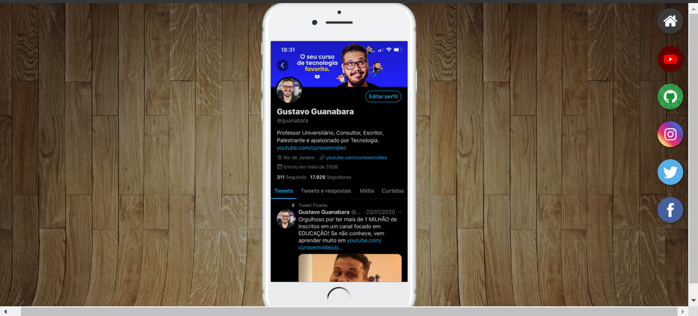
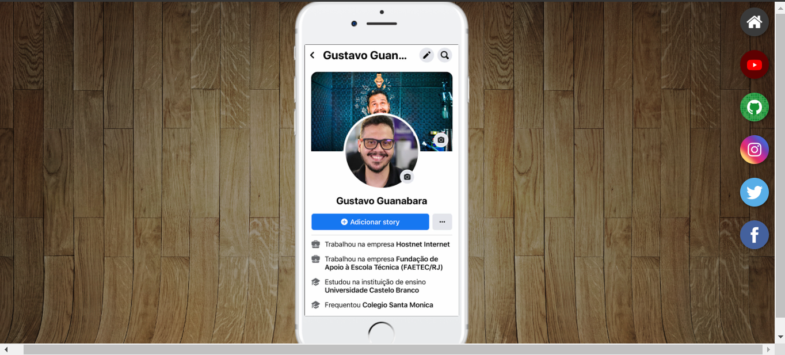

# REDES SOCIAIS VOLUME 2
👨‍🏫PROJETO FEITO PARA O CURSO DE HTML E CSS DO CURSO EM VIDEO.

 <br><br>
 <br><br>
 <br><br>
 <br><br>
 <br><br>
 <br><br>
> AS IMAGENS QUE ESTÃO NO CELULAR SÃO "ROLAVEIS". ELAS SÃO LARGAS VERTICALMENTE!

## DESCRIÇÃO:
O aplicativo "Redes Sociais" permite aos usuários acessarem os perfis de Gustavo Guanabara em diferentes plataformas de mídia social. Com o aplicativo "Redes Sociais", os usuários podem facilmente acessar e interagir com os perfis de Gustavo Guanabara em várias plataformas, mantendo-se atualizados com seu conteúdo e atividades online. Aqui estão os recursos e como usar o aplicativo:

1. **Acesso às Redes Sociais:**
   - Clique nos ícones das redes sociais disponíveis na tela principal para acessar os perfis de Gustavo Guanabara em cada plataforma.

2. **Redes Sociais Disponíveis:**
   - YouTube
   - GitHub
   - Instagram
   - Twitter
   - Facebook

3. **Navegação Simples:**
   - Use os links fornecidos para navegar diretamente para os perfis de Gustavo Guanabara em cada rede social.

4. **Visualização Rápida:**
   - As páginas individuais de cada rede social exibem uma imagem representativa da plataforma e fornecem um link direto para o perfil correspondente.

5. **Compatibilidade com Diferentes Dispositivos:**
   - O aplicativo é responsivo e pode ser usado em vários dispositivos, incluindo computadores, tablets e smartphones.

6. **Fácil Integração:**
   - Com um design simples e intuitivo, o aplicativo permite uma experiência de usuário amigável e fácil de usar.

7. **Acesso Externo:**
   - Os links são configurados para abrir em uma nova aba do navegador, garantindo que os usuários permaneçam no aplicativo enquanto exploram os perfis de Gustavo Guanabara.

## COMO USAR?
### BAIXANDO O PROJETO:
* Clone o repositório para o seu sistema local:

```bash
git clone https://github.com/VILHALVA/REDES-SOCIAIS-VOLUME-2.git
```

* Navegue até o diretório do projeto.

```bash
cd REDES-SOCIAIS-VOLUME-2
```

* Descompacte o arquivo ZIP (se você baixou manualmente):

```bash
unzip REDES-SOCIAIS-VOLUME-2.zip
```

### EXECUTANDO O PROJETO:
1. Abra o arquivo `CODIGO.html` em um navegador da web.

2. **Explorar os Perfis Sociais:**
   - Na página principal do aplicativo, você verá os ícones das diferentes redes sociais disponíveis. Clique em cada ícone para ser redirecionado para o perfil correspondente de Gustavo Guanabara na plataforma de mídia social selecionada.

3. **Navegar entre os Perfis:**
   - Para explorar outros perfis, basta clicar nos ícones das redes sociais novamente e navegar entre os diferentes perfis disponíveis.

4. **Retornar à Página Principal:**
   - Para retornar à página principal do aplicativo, clique no ícone "Home" ou no ícone da rede social principal, dependendo da estrutura de navegação do aplicativo.

## NÃO SABE?
- Entendemos que para manipular arquivos em `HTML`, `CSS` e outras linguagens relacionadas, é necessário possuir conhecimento nessas áreas. Para auxiliar nesse aprendizado, oferecemos cursos gratuitos disponíveis:
* [Curso de HTML e CSS](https://github.com/VILHALVA/CURSO-DE-HTML-E-CSS)
* [Curso de JavaScript](https://github.com/VILHALVA/CURSO-DE-JAVASCRIPT)
* [Confira mais cursos](https://github.com/VILHALVA?tab=repositories&q=+topic:CURSO)

## CREDITOS:
- [PROJETO FEITO PELO VILHALVA](https://github.com/VILHALVA)
- [PROJETO FEITO PARA O CURSO DE HTML E CSS](https://github.com/VILHALVA/CURSO-DE-HTML-E-CSS)
- [ESTÁ DISPONIVEL NO SITE](https://vilhalva.github.io/STYLER/STYLER.html)
